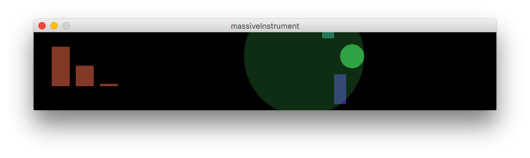

# massiveInstrument
*Régis Frias*  
*15.12.2018*

\*\*\*

massiveInstrument proposes to transform the Harpa building into a huge musical instrument during the Reykjavik Winter Lights Festival 2019.

For a more accurate preview, please use [Syphoner](http://www.sigmasix.ch/syphoner/) and [TMSyphonVisualiser](https://tinymassive.io/kit/TMApps.zip).




## Running from source

### Dependencies

- [Processing](https://processing.org/)
- [Processing Sound library](https://processing.org/reference/libraries/sound) (needs to be installed separatetly)

### Running

Open massiveInstrument.pde in Processing. Run XD

`screenScaleX` and `screenScaleY` are a visualising convenience. Set both to `1` for exact output resolution (77x13px). Set them to `10` and `15` to get a feel of the building proportions (not for production!).

## How it works

Massive Instrument expects input from two joysticks which have been mapped to keyboard keys.

Key '0' resets the application.

### Joystick 1

This is a simple sampler and controls the visuals from the left side of the building.

Keyboard mapping:

```
'W': up
'A': left
'S': down
'D': right
'Q': button 1
'E': button 2
```

The joystick up/down/left/right triggers sounds from a preloaded library. Button 2 changes the sound collection (there are two collections, 8 samples in total, maybe I can add one or two more if the work is approved). Button 1 changes the width of the visual elements.

Sixty-four beats (`AUTOMATIC_MODE_1` in the code) without activity triggers the automatic mode, which randomly triggers the sounds and images.

### Joystick 2

This is a step sequencer (drum machine) and controls the right side of the building.

Keyboard mapping:

```
'I': up
'J': left
'K': down
'L': right
'U': button 1
'O': button 2
```

The user always starts with a preset pattern, like the following:

```
Track 1 |   - - X X - - X X - - X X - - X -
Track 2 |   - - - - - - - - - - - - - - - -
Track 3 |   - - - - - - - - - - - - - X - -
Track 4 |   X - - - X - - - X - - - X - - -
```

The joystick works as you would expect: it moves a cursor (white rectangle) across the right screen. Button 1 sets the current grid cell on/off (red/black).


Leave the joystick alone for a short while to watch the sequencer play your beats without visual disturbance.

Button 2 clears the screen so the user can start from scratch. Silence...

One hundred and twenty-eight beats (`AUTOMATIC_MODE_2`) without activity triggers the automatic mode, which randomly choses a preset. The playhead never stops (but doesn't play any sound if there's nothing selected).

## To-do

I realised too late that the Processing sound library is $#|7. If the work is selected I will try something else (Minim? PD?).

## About me

I'm a Brazilian interaction designer, front end developer and creative coder based in Helsinki. You can see a selection of my work here: http://regisfrias.com/

\*\*\*

*Þakka þér fyrir and enjoy!*
